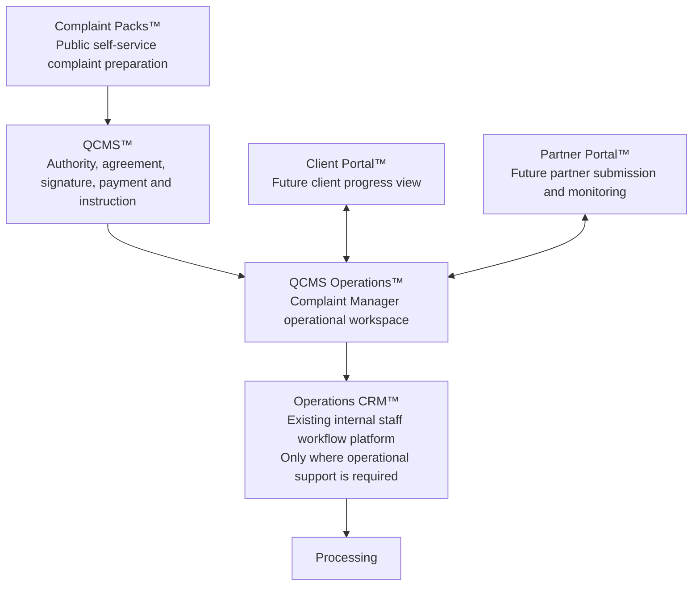
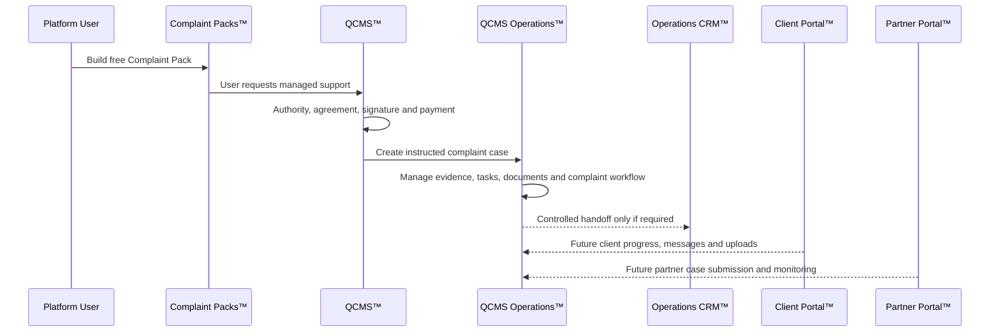

# Quaerens Platform Blueprint

Version: 1.1.0  
Status: Approved Architecture  
Document type: Operational Architecture Blueprint  
Scope: Quaerens Platform systems, responsibilities, boundaries and roadmap

## Purpose

This Blueprint defines the approved operational architecture for the Quaerens Platform.

Version 1.1 replaces the previous assumption that QCMS would integrate directly into the existing CRM. The existing CRM remains the internal staff workflow platform for leads, sales and business operations. QCMS will instead receive its own dedicated operational layer: QCMS Operations.

The purpose of this architecture is to keep the Quaerens platform clear, scalable and operationally safe by separating:

- Public self-service complaint preparation
- Commercial managed complaint instruction
- Complaint management operations
- Internal lead and sales workflows
- Client case visibility
- Partner case submission and reporting

## Architecture Overview

The Quaerens Platform consists of six major systems:

1. Complaint Packs
2. QCMS
3. QCMS Operations
4. Operations CRM
5. Client Portal
6. Partner Portal

## System 1: Complaint Packs

Complaint Packs is the public self-service platform.

### Responsibilities

- Free DIY complaint preparation
- Evidence collection
- Timeline creation
- Complaint Pack generation
- Recommendation Engine
- Case Health
- Evidence Completeness
- Complaint Readiness

### Users

- Platform Users

### Boundary

Complaint Packs helps users prepare structured complaint materials. It does not create a managed QCMS case by itself and does not make the user a client until the QCMS instruction process is completed.

## System 2: QCMS

QCMS is the commercial managed complaint services layer.

### Responsibilities

- Authority to Act
- Client Agreement
- Electronic Signature
- Payment
- Instruction
- Service selection

### Users

- Platform Users becoming Clients

### Boundary

QCMS is the conversion and instruction layer between free self-service Complaint Packs and managed complaint support. It confirms the user's authority, agreement, payment and instruction before any managed case enters QCMS Operations.

## System 3: QCMS Operations

QCMS Operations is a new dedicated operational platform for instructed QCMS cases.

### Purpose

QCMS Operations is the workspace used by Complaint Managers to manage all instructed QCMS cases after the QCMS instruction process is complete.

### Users

- Complaint Managers

### Core Modules

- Dashboard
- Assigned Cases
- New Instructions
- Evidence Requests
- Internal Notes
- Tasks
- Timeline
- Documents
- Messages
- Complaint Preparation
- Ready for Submission
- Submitted
- Awaiting Response
- Resolved

### Explicit Exclusions

QCMS Operations does not include:

- Lead Management
- Appointments
- Listers
- Closers
- Sales Pipelines
- Campaigns

### Boundary

QCMS Operations is for complaint management work only. It should not become a duplicate CRM, sales platform or marketing pipeline.

## System 4: Operations CRM

Operations CRM is the existing CRM.

### Purpose

Operations CRM remains the internal lead and business operations platform.

### Users

- Listers
- Managers
- Closers
- Processing
- Administration

### Core Modules

- Lead Management
- Appointments
- Campaigns
- Sales Pipeline
- Processing
- Reporting
- Documents
- User Management

### Boundary

Operations CRM remains unchanged. It continues to support internal staff workflows, sales operations and business administration. It is independent from QCMS Operations except where a future approved workflow requires a controlled handoff.

## System 5: Client Portal

Client Portal is a future phase.

### Purpose

Client Portal will allow clients to monitor complaint progress after they have instructed QCMS.

### Planned Features

- Messages
- Timeline
- Documents
- Case Status
- Uploads
- Notifications

### Relationship

Client Portal communicates with QCMS Operations.

## System 6: Partner Portal

Partner Portal is a future phase.

### Purpose

Partner Portal will allow approved business partners to submit and monitor cases.

### Planned Features

- Case Submission
- Progress
- Messages
- Documents
- Performance
- Reporting

### Relationship

Partner Portal communicates with QCMS Operations.

## User Roles

| Role | Primary System | Purpose |
| --- | --- | --- |
| Platform User | Complaint Packs | Uses free self-service tools and prepares Complaint Packs |
| Platform User becoming Client | QCMS | Completes authority, agreement, signature, payment and instruction |
| Client | QCMS Operations / Client Portal | Receives managed complaint support and monitors progress |
| Complaint Manager | QCMS Operations | Manages instructed QCMS complaint cases |
| Lister | Operations CRM | Handles lead and intake workflows |
| Closer | Operations CRM | Handles sales and conversion workflows |
| Manager | Operations CRM | Manages internal staff and business workflows |
| Processing | Operations CRM | Handles internal processing workflows |
| Administration | Operations CRM | Supports internal records, reporting and administration |
| Partner | Partner Portal | Submits and monitors partner-referred cases |

## System Relationships

Complaint Packs feeds QCMS when a Platform User chooses to request managed support.

QCMS creates the instruction layer required before a case becomes operationally managed.

QCMS Operations manages instructed complaint cases.

Operations CRM remains the existing internal staff workflow platform and is not replaced by QCMS Operations.

Client Portal and Partner Portal will communicate with QCMS Operations in future phases.

## Design Principles

### Separation of Responsibilities

Sales, complaint management, client access and partner access must remain separate.

### No Duplicate Functionality

Each system must have a clearly defined responsibility. Functionality should not be rebuilt in another system unless a future Blueprint amendment approves the change.

### Clear User Transition

A Platform User remains a Platform User while using Complaint Packs. They become a Client only after the QCMS instruction process is completed.

### Existing CRM Protection

Operations CRM remains the lead management and internal sales workflow platform. QCMS Operations must not absorb or duplicate lister, closer, campaign or sales pipeline workflows.

### Complaint Management Focus

QCMS Operations exists to support Complaint Managers and instructed complaint cases. It should remain focused on evidence, tasks, communications, documents, timelines, complaint preparation and case progress.

### Future Portal Boundaries

Client Portal and Partner Portal should communicate with QCMS Operations, not replace it.

## Future Roadmap

### Phase 1: Architecture Alignment

- Adopt this Blueprint as the approved architecture.
- Treat QCMS Operations as the future operational workspace for instructed QCMS cases.
- Keep Operations CRM unchanged.

### Phase 2: QCMS Instruction Layer

- Define the QCMS flow for Authority to Act, Client Agreement, Electronic Signature, Payment, Instruction and Service selection.
- Confirm when a Platform User becomes a Client.

### Phase 3: QCMS Operations Foundation

- Design the Complaint Manager dashboard.
- Define instructed case records.
- Define modules for evidence requests, tasks, internal notes, timelines, documents, messages and complaint preparation.

### Phase 4: Client Portal

- Allow clients to monitor progress, upload documents, view timelines and exchange messages.

### Phase 5: Partner Portal

- Allow partners to submit cases, monitor progress, exchange messages, access documents and review reporting.

### Phase 6: Controlled Operations CRM Handoffs

- Define limited, approved handoffs between QCMS Operations and Operations CRM only where required for processing or administration.

## Implementation Guardrails

- Do not integrate QCMS directly into the existing CRM.
- Do not duplicate lead management inside QCMS Operations.
- Do not duplicate Complaint Manager case handling inside Operations CRM.
- Do not create Client Portal or Partner Portal functionality inside Operations CRM.
- Do not change Operations CRM modules without a separate approved architecture amendment.
- Do not start clean URL, deployment, database, API or payment work from this Blueprint alone.

## Version History

| Version | Status | Summary |
| --- | --- | --- |
| 1.0 | Superseded | Earlier platform architecture assumed QCMS would integrate directly into the existing CRM. |
| 1.1.0 | Approved Architecture | Introduces QCMS Operations as the dedicated operational workspace for instructed QCMS cases while preserving Operations CRM as the existing internal staff workflow platform. |

