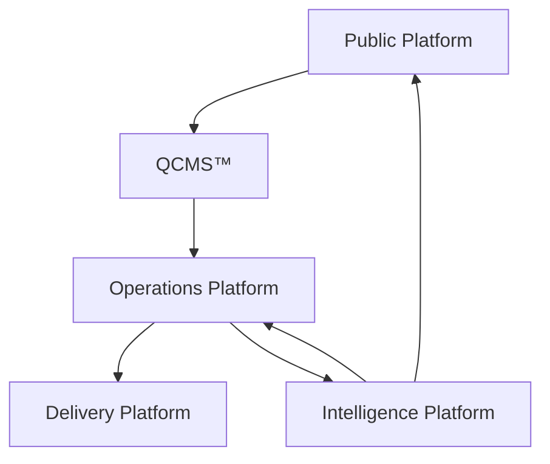

# The Quaerens Platform Ecosystem™

Version: 1.0.0  
Status: Strategic Architecture  
Document Type: Platform Ecosystem Blueprint  
Owner: Quaerens Ltd

## Purpose

This document defines the complete Quaerens Platform Ecosystem™.

It explains how every public product, commercial service, operational workspace and future platform component fits together as one coordinated architecture.

It is intended for:

- Directors
- Staff
- Partners
- Developers
- Product designers
- Investors
- Strategic partners

The document is written to be understandable without technical knowledge.

## Introduction

Quaerens is no longer simply a consumer complaint business.

Quaerens is building an evidence-first consumer complaint platform that helps people resolve disputes through clear information, structured evidence, self-service Complaint Packs™, professional support and operational case workflows.

The platform is organised as a set of connected ecosystems. Each ecosystem has a clear role, defined users and separate responsibilities. Together, they support the same mission:

Helping people resolve consumer complaints more efficiently, more confidently and with better organised evidence.

## Ecosystem Overview

The Quaerens Platform Ecosystem™ consists of four connected ecosystems:

1. Public Platform
2. Operations Platform
3. Delivery Platform
4. Intelligence Platform

These ecosystems are connected, but they do not duplicate each other.

## Ecosystem One: Public Platform

### Purpose

The Public Platform helps consumers understand their rights, identify the correct route and begin resolving a complaint.

It is the public-facing layer of Quaerens.

### Core Components

- Consumer Complaint Centres™
- Knowledge Centre™
- Consumer Rights Centre™
- Complaint Packs™
- Evidence Collection™
- Complaint Readiness™
- QCMS™

### Primary Users

- Platform Users
- Consumers researching a problem
- Consumers preparing a complaint
- Consumers deciding whether to use self-service or managed support

### Responsibilities

The Public Platform is responsible for:

- Helping users understand common consumer complaint issues
- Providing educational guidance
- Offering free self-service complaint preparation
- Collecting structured facts
- Helping users organise evidence
- Generating Complaint Packs™
- Assessing complaint readiness
- Presenting relevant QCMS™ managed service options

### Public User Journey

Search  
↓  
Consumer Complaint Centre™  
↓  
Knowledge and guidance  
↓  
Evidence collection  
↓  
Complaint Pack™  
↓  
Complaint Readiness™  
↓  
DIY route or QCMS™

### Design Principle

The Public Platform should help users take practical action without overwhelming them.

It must remain evidence-led, plain-English and transparent about what the user can do themselves and when managed support may be appropriate.

## Ecosystem Two: Operations Platform

### Purpose

The Operations Platform provides Complaint Managers with the operational tools required to manage instructed QCMS™ cases professionally.

This is not a sales CRM. It is the complaint management workspace.

### Core Components

- QCMS Operations™
- Operations Centre™
- Case Workspace™
- Complaint Journey™
- Complaint Readiness™
- Workspace Actions™
- Evidence Intelligence™
- Document Intelligence™
- Operational Timeline™

Evidence Intelligence™ and Document Intelligence™ are future capability areas and should be introduced only when the product architecture is ready.

### Primary Users

- Complaint Managers
- Operational complaint staff
- Processing and administration staff where appropriate

### Responsibilities

The Operations Platform is responsible for:

- Managing instructed complaint cases
- Reviewing client instructions
- Tracking evidence requests
- Managing internal notes
- Managing operational tasks
- Maintaining case timelines
- Reviewing documents
- Preparing complaint materials
- Tracking readiness for submission
- Monitoring submitted complaints
- Tracking responses and outcomes

### Action-Driven Workspace

The Operations Platform must be action-driven rather than information-driven.

Complaint Managers should always be able to see:

- What needs attention
- What can wait
- What is ready
- What is missing
- What should happen next

### Operational Stages

QCMS Operations™ should support the following operational stages:

- New Instruction
- Evidence Requested
- Evidence Received
- Under Review
- Complaint Preparation
- Ready for Submission
- Submitted
- Awaiting Response
- Further Evidence Needed
- Resolved
- Closed

### Separation From CRM

QCMS Operations™ does not include:

- Lead management
- Appointments
- Listers
- Closers
- Sales pipelines
- Campaign management

Those responsibilities remain within Operations CRM™.

## Ecosystem Three: Delivery Platform

### Purpose

The Delivery Platform keeps clients, partners and operational teams connected during the complaint journey.

It provides visibility and collaboration without merging separate operational responsibilities.

### Core Components

- Client Portal™
- Partner Portal™
- Operations CRM™
- Complaint Managers™

### Responsibilities

The Delivery Platform is responsible for:

- Giving clients visibility of complaint progress
- Allowing clients to view messages, timelines, documents and status updates
- Allowing partners to submit and monitor cases
- Supporting internal lead and business workflows through Operations CRM™
- Keeping sales operations separate from complaint management

### Client Portal™

The Client Portal™ is a future phase.

Its purpose is to let clients monitor complaint progress and interact with their case in a structured way.

Expected features include:

- Messages
- Timeline
- Documents
- Case status
- Uploads
- Notifications

### Partner Portal™

The Partner Portal™ is a future phase.

Its purpose is to let business partners submit and monitor cases.

Expected features include:

- Case submission
- Progress tracking
- Messages
- Documents
- Performance reporting

### Operations CRM™

Operations CRM™ remains the existing operational CRM for lead management and internal business workflows.

Its core responsibilities include:

- Lead management
- Appointments
- Campaigns
- Sales pipeline
- Processing
- Reporting
- Documents
- User management

Operations CRM™ remains independent from QCMS Operations™.

## Ecosystem Four: Intelligence Platform

### Purpose

The Intelligence Platform allows Quaerens to improve the quality, consistency and efficiency of complaint support over time.

It should support decision-making without replacing human review where judgement is required.

### Core Components

- Evidence Intelligence™
- Document Intelligence™
- Complaint Readiness™
- Case Health™
- Recommendation Engine™
- Smart Submission™
- Category intelligence
- Route intelligence
- Outcome learning

### Responsibilities

The Intelligence Platform is responsible for:

- Identifying evidence gaps
- Assessing complaint readiness
- Supporting route recommendations
- Helping structure timelines
- Highlighting missing documents
- Supporting Complaint Pack™ quality
- Improving consistency across builders
- Supporting future operational insights

### Human Review Principle

The Intelligence Platform supports human decision-making.

It must not imply that outcomes are guaranteed, complaints are automatically submitted or regulated advice is being provided where that is not the case.

## System Relationships

The main relationship between systems is:

Complaint Packs™  
↓  
QCMS™  
↓  
QCMS Operations™  
↓  
If required  
↓  
Operations CRM™  
↓  
Processing

Client Portal™ communicates with QCMS Operations™.

Partner Portal™ communicates with QCMS Operations™.

Operations CRM™ remains independent.

## Responsibility Boundaries

### Complaint Packs™

Complaint Packs™ are public self-service tools.

They help users prepare structured complaint documents, evidence lists, timelines and readiness summaries.

They do not automatically submit complaints.

### QCMS™

QCMS™ is the commercial managed complaint service layer.

It handles:

- Authority to Act
- Client Agreement
- Electronic Signature
- Payment
- Instruction
- Service selection

### QCMS Operations™

QCMS Operations™ is the operational workspace for instructed complaint cases.

It is used by Complaint Managers and operational staff to manage complaint work after instruction.

### Operations CRM™

Operations CRM™ remains the internal lead and business operations platform.

It should not be overloaded with complaint-management functionality that belongs in QCMS Operations™.

### Client Portal™

The Client Portal™ gives clients visibility of their instructed case.

### Partner Portal™

The Partner Portal™ gives business partners a structured submission and monitoring channel.

## User Roles

### Platform User

A person using the public website, guides, tools or Complaint Packs™.

### Client

A Platform User who has moved into QCMS™ and instructed Quaerens for managed complaint support.

### Complaint Manager

A staff member responsible for progressing instructed complaint cases inside QCMS Operations™.

### Lister

A staff member using Operations CRM™ for lead and appointment workflows.

### Closer

A staff member using Operations CRM™ for sales and conversion workflows.

### Processing

Staff responsible for internal processing, administration and operational support.

### Partner

A business partner who may submit or monitor cases through Partner Portal™ in a future phase.

## Architecture Principles

### 1. Clear Separation

Sales, complaint management, client visibility and partner collaboration must remain separate.

### 2. No Duplication

Each platform should have one clear source of truth for its own responsibility.

### 3. Evidence First

Every complaint journey should begin with facts, documents, timeline and evidence quality.

### 4. Human-Led Operations

Automation and intelligence should support staff, not create misleading certainty.

### 5. Transparent User Choices

Users should understand the difference between:

- Self-service tools
- Complaint Packs™
- Managed QCMS™ services
- Future client or partner portal features

### 6. Scalable Architecture

The platform should support new complaint categories, new builders, new operational workflows and future portals without rebuilding the core architecture.

## Future Roadmap

### Phase 1: Public Platform and Complaint Packs™

- Expand Complaint Pack builders
- Standardise builder architecture
- Improve Complaint Readiness™
- Strengthen Consumer Complaint Centres™
- Improve knowledge and internal linking

### Phase 2: QCMS™

- Standardise Authority to Act
- Standardise Client Agreement
- Standardise service selection
- Standardise payment and instruction flow

### Phase 3: QCMS Operations™

- Build the Operations Centre™
- Build Case Workspace™
- Introduce action-driven case management
- Introduce complaint journey tracking
- Introduce readiness and evidence views

### Phase 4: Client Portal™

- Client messages
- Case status
- Document uploads
- Timeline view
- Notifications

### Phase 5: Partner Portal™

- Partner case submission
- Partner case monitoring
- Partner document workflows
- Partner reporting

### Phase 6: Intelligence Platform

- Evidence Intelligence™
- Document Intelligence™
- Route recommendations
- Case Health™
- Outcome learning
- Quality and consistency reporting

## Strategic Summary

The Quaerens Platform Ecosystem™ is a connected architecture for consumer complaint resolution.

It combines public education, self-service complaint preparation, managed commercial services, operational case management and future portal infrastructure.

The strategic direction is clear:

- Complaint Packs™ help users prepare.
- QCMS™ converts suitable users into instructed clients.
- QCMS Operations™ manages the complaint work.
- Operations CRM™ continues to manage internal lead and business operations.
- Client Portal™ and Partner Portal™ provide future visibility and collaboration.
- The Intelligence Platform improves consistency, evidence quality and decision support.

This ecosystem allows Quaerens to grow without confusing sales workflows, complaint operations, client communication and partner collaboration.

## Version Record

Version: 1.0.0  
Status: Strategic Architecture  
Approved for: Platform planning, product design, operational planning and future implementation guidance.
